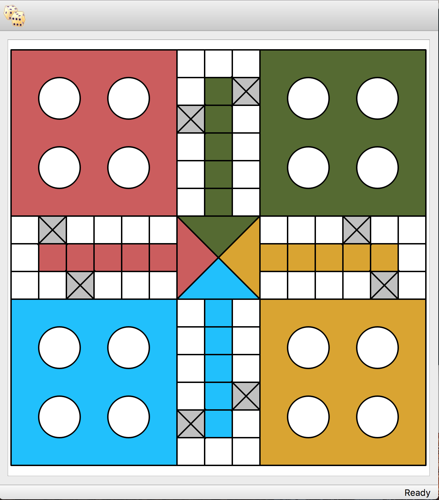

# A Game of Ludo in Pyqt5

This is my first development in QT.
I will be using Qt5 to develop a game of Ludo.

Ludo is a board game quite popular in the Indian
subcontinent. You can read more about this game at
[Wiki](https://en.wikipedia.org/wiki/Ludo_%28board_game%29).

